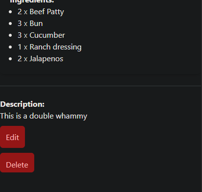
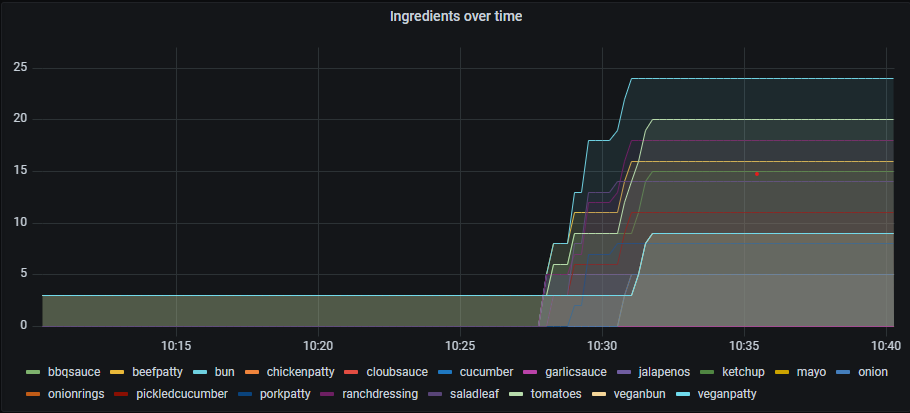

# Cooking Site

This project was about learning Laravel. It is about 

## Table of Content
---
- [Built With](#built-with)
- [What is it](#What-is-it)

## Built with

This was built using Laravel sail, Prometheus, Grafana, MySQL and Redis. Laravel is responsible for serving the actual webpage. It also saves some stats to Redis and the main data is persisted in a MySQL database. 

## What is it

### The site
The main feature is the cooking site which allows adding, editing and deleting recipees. (There is no user auth, it was outside of the scope of the project.)

    

This shows the home screen.

    

This shows the view of a burger

    

You can edit or delete a burger.

    

And of course add burgers

### The stats
The project also features a grafana dashboard that tracks stats. The data is stored in a redis db and made accessible at a `/metrics` endpoint. Prometheus then makes that data availiable to grafana.

The dashboard looks like this:

    

The top left tracks the ingredients that were most looked up over time, the pie chart below shows the same data but in a different format. The time series on the right shows the most requested routes and the pie chart below shows the same data but in a different format.

    

This is a closeup of the ingredients usage over time stat tracker.